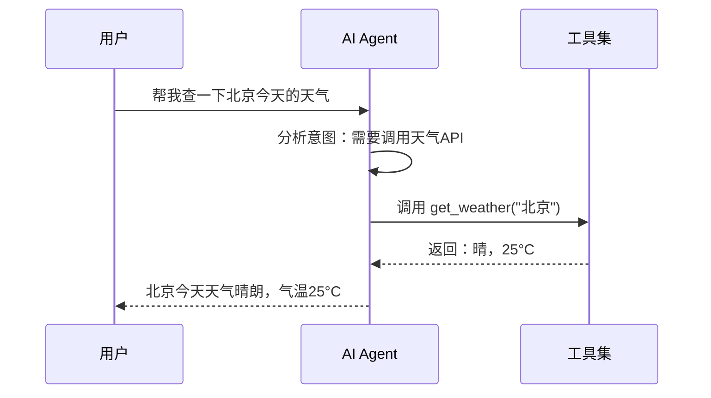
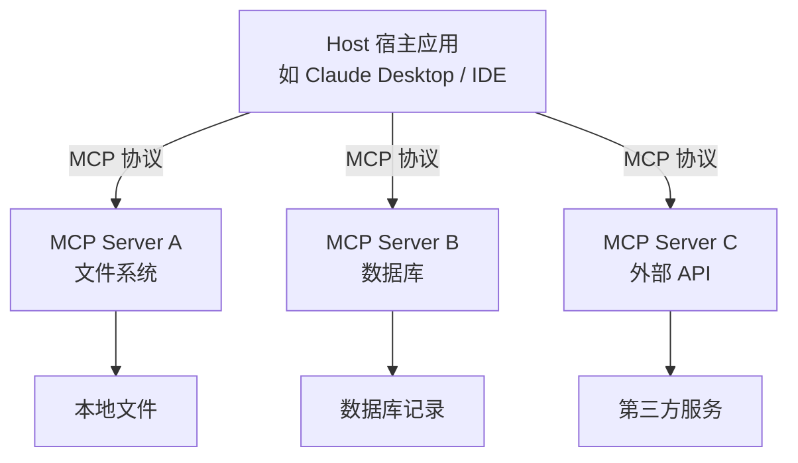
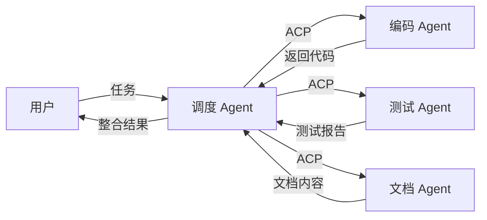

# 前言

随着大语言模型（LLM）的飞速发展，AI Agent 已经从概念走向了现实。现代 AI Agent 不再是简单的「一问一答」聊天机器人，而是具备了**工具调用**、**联网搜索**、**技能执行**等高级能力，能够像人类一样主动完成复杂任务。

本文将带你了解现代 AI Agent 的核心功能，帮助你更好地理解和使用 AI Agent。

# Tool Call（工具调用/函数调用）

## 是什么

Tool Call（也叫 Function Call）是 AI Agent 最核心的能力之一。它允许 AI 模型在对话过程中**主动调用外部工具或函数**，从而突破纯文本生成的能力边界。

简单来说：AI 不再只是「说话」，它还能「做事」。

## 工作原理



## 典型应用场景

- **查询实时数据**：天气、股票、汇率等
- **操作外部系统**：发送邮件、创建日程、操作数据库
- **文件操作**：读写文件、执行代码
- **多步骤任务**：先查数据，再分析处理，最后生成报告

## 调用方式

大多数 LLM 平台（OpenAI、Anthropic、Google 等）都提供了标准化的 Tool Call API：

```python
# 以 OpenAI 为例
tools = [
    {
        "type": "function",
        "function": {
            "name": "get_weather",
            "description": "获取指定城市的天气信息",
            "parameters": {
                "type": "object",
                "properties": {
                    "city": {
                        "type": "string",
                        "description": "城市名称"
                    }
                },
                "required": ["city"]
            }
        }
    }
]

response = client.chat.completions.create(
    model="gpt-4",
    messages=[{"role": "user", "content": "北京天气怎么样？"}],
    tools=tools
)
```

当 AI 判断需要调用工具时，它会返回一个 `tool_calls` 响应，包含函数名和参数。你的程序执行该函数后，将结果返回给 AI，AI 再基于结果生成最终回复。

# Web Search（联网搜索）

## 是什么

Web Search 让 AI Agent 能够**实时搜索互联网**获取最新信息，解决了大模型「知识截止日期」的限制。

## 为什么需要

大语言模型的知识停留在训练截止日期。对于以下场景，联网搜索至关重要：

| 场景       | 说明                  |
| ---------- | --------------------- |
| 新闻事件   | 今天发生了什么        |
| 实时数据   | 最新股价、天气、赛果  |
| 新版本技术 | 刚发布的框架/库的文档 |
| 事实核查   | 验证信息的准确性      |

## 实现方式

Web Search 本质上也是 Tool Call 的特例。AI 调用搜索工具 → 获取搜索结果 → 整合后回复用户：

```python
tools = [
    {
        "type": "function",
        "function": {
            "name": "web_search",
            "description": "搜索互联网获取最新信息",
            "parameters": {
                "type": "object",
                "properties": {
                    "query": {
                        "type": "string",
                        "description": "搜索关键词"
                    }
                },
                "required": ["query"]
            }
        }
    }
]
```

# Skills（技能）

## 是什么

Skills 是预定义的、可复用的**能力模块**，让 AI Agent 能够执行特定领域的任务。可以把 Skills 理解为「给 AI Agent 安装的 App」。

## 常见技能类型

### 代码执行与解释

AI 可以执行代码（通常在沙箱中），验证逻辑或生成计算结果：

```python
# AI 可以自己写代码并执行来回答问题
# 用户：计算斐波那契数列前20项的平方和
def fibonacci(n):
    a, b = 0, 1
    result = []
    for _ in range(n):
        result.append(a)
        a, b = b, a + b
    return result

fibs = fibonacci(20)
squared_sum = sum(x**2 for x in fibs)
print(squared_sum)  # AI 执行并返回结果
```

### 文档处理

- 读取和分析 PDF、Word、Excel 文件
- 从图片中提取文字（OCR）
- 生成图表和可视化

### 多模态能力

- 图片识别与生成
- 语音转文字、文字转语音
- 视频内容理解

## Skills vs Tool Call

| 维度   | Tool Call       | Skills                         |
| ------ | --------------- | ------------------------------ |
| 粒度   | 单个函数/API    | 一组相关能力的集合             |
| 复杂度 | 简单、原子化    | 复杂、可组合                   |
| 例子   | `get_weather()` | 「数据分析」技能（含多个步骤） |

> [!TIP]
> 在现代 AI Agent 框架中，Skills 通常由多个 Tool Call 组合而成，形成一个完整的工作流。

# MCP（Model Context Protocol）

## 是什么

**MCP**（模型上下文协议）是由 Anthropic 推出的一套**开放标准协议**，旨在统一 AI 模型与外部工具、数据源之间的连接方式。

可以把 MCP 理解为 AI 世界的「USB-C 接口」—— 统一的连接标准，让任何 AI 模型都能对接任何工具和数据源。

## 架构



## 核心概念

### Resources（资源）

暴露数据给 AI 模型读取，类似于 REST API 的 GET 端点：

```json
{
  "uri": "file:///docs/report.txt",
  "mimeType": "text/plain",
  "text": "这是报告的内容..."
}
```

### Tools（工具）

让 AI 模型执行操作，类似于 REST API 的 POST 端点：

```json
{
  "name": "create_file",
  "description": "创建一个新文件",
  "inputSchema": {
    "type": "object",
    "properties": {
      "path": { "type": "string" },
      "content": { "type": "string" }
    }
  }
}
```

### Prompts（提示模板）

预定义的对话模板，帮助用户快速开始特定任务。

## 为什么 MCP 重要

在 MCP 之前，每个 AI 应用都要自己造轮子来对接各种工具。这就导致：

- 🔴 每个 AI 应用都要为同样的工具重写集成代码
- 🔴 工具生态碎片化，互不兼容
- 🔴 开发者在不同 AI 平台间切换成本高

MCP 解决了这些问题：**一次编写，到处使用**。

## 快速上手

以 Claude Desktop 为例，配置 MCP Server：

```json
// claude_desktop_config.json
{
  "mcpServers": {
    "filesystem": {
      "command": "npx",
      "args": [
        "-y",
        "@modelcontextprotocol/server-filesystem",
        "/path/to/workspace"
      ]
    },
    "github": {
      "command": "npx",
      "args": ["-y", "@modelcontextprotocol/server-github"]
    }
  }
}
```

配置完成后，Claude 就可以直接操作你的文件系统、访问 GitHub 仓库了。

> [!NOTE]
> MCP 生态正在快速成长。目前已有大量社区提供现成的 MCP Server，覆盖数据库、云服务、办公工具等各个领域。你可以在 [MCP 官方仓库](https://github.com/modelcontextprotocol) 找到更多资源。

# ACP（Agent Communication Protocol）

## 是什么

**ACP**（Agent Communication Protocol）是 Google 推出的一套用于 **AI Agent 之间通信**的开放协议。如果说 MCP 解决的是「AI 如何连接工具」，那么 ACP 解决的是「AI 之间如何协作」。

## 核心理念

ACP 的目标是让不同的 AI Agent 能够像微服务一样互相通信、协作完成更复杂的任务。



## 主要特性

### Agent Discovery（Agent 发现）

Agent 可以自动发现其他可用的 Agent 及其能力：

```json
{
  "agents": [
    {
      "id": "code-reviewer-01",
      "capabilities": ["code_review", "bug_detection"],
      "endpoint": "acp://agents.internal/code-reviewer"
    },
    {
      "id": "tester-01",
      "capabilities": ["unit_test", "integration_test"],
      "endpoint": "acp://agents.internal/tester"
    }
  ]
}
```

### Task Delegation（任务委派）

调度 Agent 可以将子任务委派给专业 Agent：

```json
{
  "task_id": "task-001",
  "type": "delegation",
  "agent": "code-reviewer-01",
  "payload": {
    "action": "review",
    "code": "...",
    "language": "python"
  }
}
```

### 状态同步

Agent 之间可以共享上下文和状态，确保协作一致性。

## ACP vs MCP

| 维度     | MCP             | ACP            |
| -------- | --------------- | -------------- |
| 发起方   | Anthropic       | Google         |
| 解决问题 | AI ↔ 工具的连接 | AI ↔ AI 的协作 |
| 类比     | USB-C 接口      | 微服务通信协议 |
| 层级     | 工具层          | Agent 层       |

两者互补而非竞争：MCP 让单个 Agent 能力更强，ACP 让多个 Agent 协作更高效。

# 总结

现代 AI Agent 的五项核心能力：

| 能力           | 一句话总结                          |
| -------------- | ----------------------------------- |
| **Tool Call**  | 让 AI 能「做事」而不只是「说话」    |
| **Web Search** | 突破知识截止日期，获取实时信息      |
| **Skills**     | 预置的能力模块，像给 AI 装 App      |
| **MCP**        | 统一的 AI-工具连接标准（Anthropic） |
| **ACP**        | 统一的 Agent 间通信标准（Google）   |

随着 MCP 和 ACP 这类开放协议的推广，AI Agent 生态正在从「各自为战」走向「标准化协作」。未来，我们可以期待一个 AI Agent 像今天的微服务一样无缝协作的世界。

> [!TIP]
> 如果你想深入了解 AI Agent 开发，推荐关注以下资源：
>
> - [MCP 官方文档](https://modelcontextprotocol.io/)
> - [LangChain](https://www.langchain.com/) - 最流行的 AI Agent 开发框架
> - [CrewAI](https://www.crewai.com/) - 多 Agent 协作框架
> - [AutoGen](https://microsoft.github.io/autogen/) - 微软的多 Agent 对话框架
