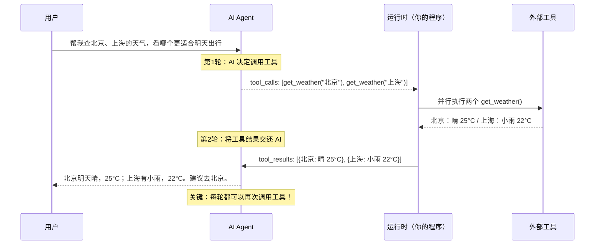
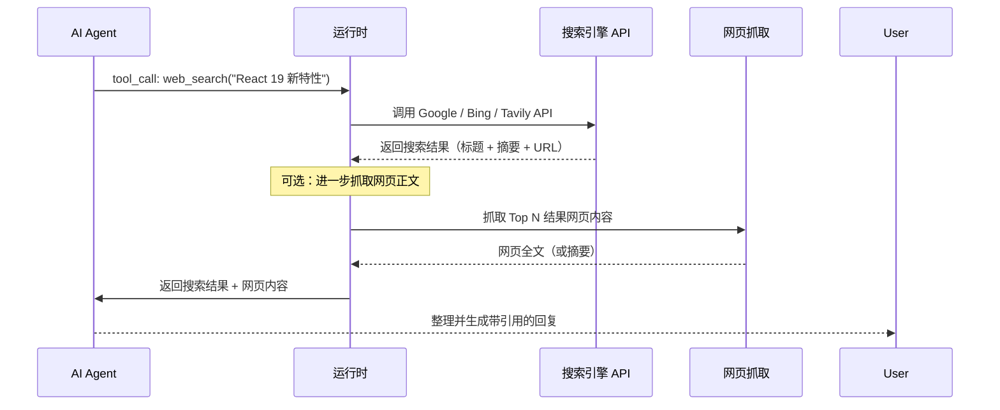
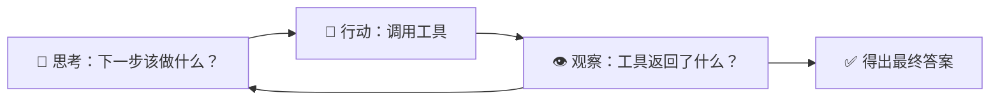
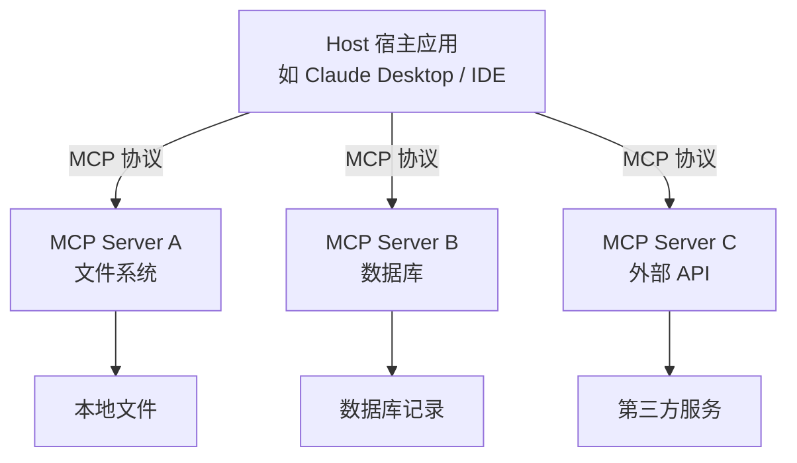
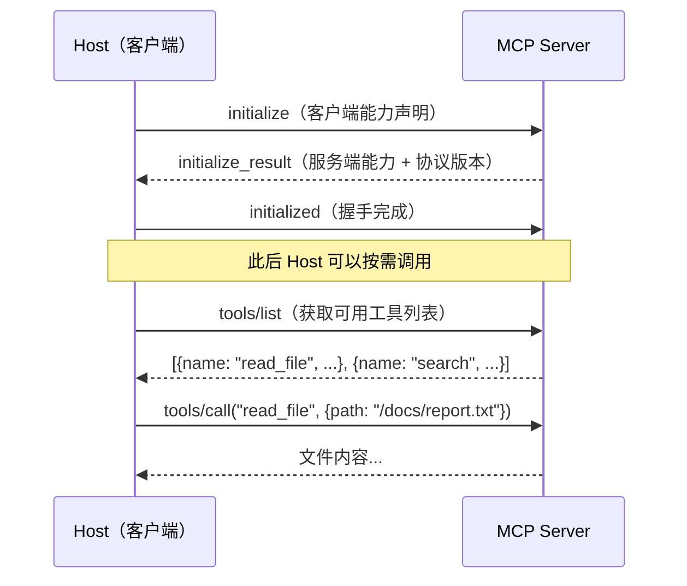
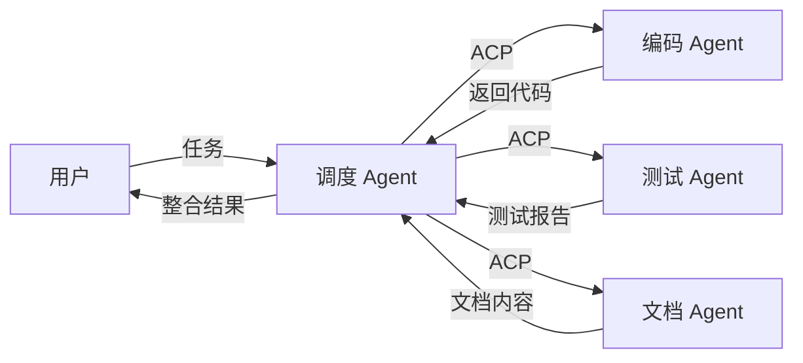
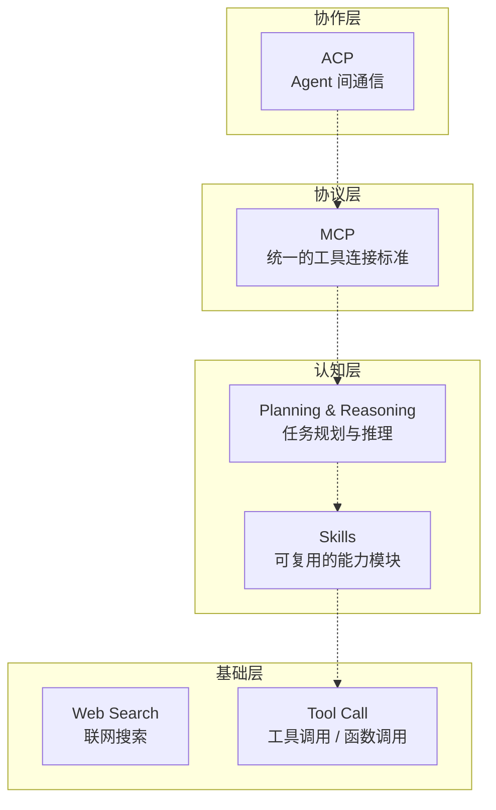

# 前言

如果你用过 ChatGPT 或 Claude，你可能觉得它们已经很聪明了——问什么答什么。但当你需要它帮你**查今天的股价**、**整理本地文件**、**部署一个项目**时，单纯的文本生成就不够用了。

这正是 AI Agent 要解决的问题。现代 AI Agent 不再是简单的「一问一答」聊天机器人，而是具备了**工具调用**、**自主规划**、**联网搜索**、**多 Agent 协作**等高级能力，能够像人类一样感知环境、制定计划、执行行动。

本文将自底向上，从最基础的 Tool Call 出发，逐步拆解构成现代 AI Agent 的六项核心能力，帮助你建立对 AI Agent 架构的系统认知。

# Tool Call（工具调用 / 函数调用）

## 是什么

Tool Call（也叫 Function Call）是 AI Agent 最核心的能力之一。它允许 AI 模型在对话过程中**主动调用外部工具或函数**，从而突破纯文本生成的能力边界。

简单来说：AI 不再只是「说话」，它还能「做事」。

## 完整调用回环

很多文章只展示了定义工具这一步，但理解「完整回环」才能真正理解 Agent 的工作方式：



要点：

1. **AI 不直接执行工具**——它只返回「我想调用哪个函数 + 什么参数」，由你的程序实际执行
2. **结果必须回传**——执行结果要以 `tool` 角色的消息追加到对话历史中，AI 才能基于它生成最终回复
3. **可以多轮**——AI 拿到第一次工具结果后，可能发现还需要更多数据，继续调用第二轮工具

## 调用方式

大多数 LLM 平台（OpenAI、Anthropic、Google 等）都提供了标准化的 Tool Call API。以 OpenAI 为例，完整的调用流程如下：

```python
import json
from openai import OpenAI

client = OpenAI()

# 1. 定义工具
tools = [
    {
        "type": "function",
        "function": {
            "name": "get_weather",
            "description": "获取指定城市的天气信息，返回天气状况和温度",
            "parameters": {
                "type": "object",
                "properties": {
                    "city": {
                        "type": "string",
                        "description": "城市名称"
                    }
                },
                "required": ["city"]
            }
        }
    }
]

messages = [{"role": "user", "content": "北京天气怎么样？"}]

# 2. 第一次请求：AI 决定调用工具
response = client.chat.completions.create(
    model="gpt-4",
    messages=messages,
    tools=tools,
    tool_choice="auto"  # auto | required | none | 指定工具
)

# 3. 检查是否有 tool_calls
msg = response.choices[0].message
if msg.tool_calls:
    # 将 AI 的 tool_calls 消息加入历史
    messages.append(msg)

    for tool_call in msg.tool_calls:
        func_name = tool_call.function.name
        func_args = json.loads(tool_call.function.arguments)

        # 你的程序实际执行工具
        if func_name == "get_weather":
            result = call_weather_api(func_args["city"])

        # 将执行结果以 tool 角色加入历史
        messages.append({
            "role": "tool",
            "tool_call_id": tool_call.id,
            "content": json.dumps(result, ensure_ascii=False)
        })

    # 4. 第二次请求：AI 基于工具结果生成最终回复
    final_response = client.chat.completions.create(
        model="gpt-4",
        messages=messages,
    )
    print(final_response.choices[0].message.content)
```

### tool_choice 参数

`tool_choice` 控制 AI 是否以及如何选择工具：

| 值           | 含义                              |
| ------------ | --------------------------------- |
| `"auto"`     | 默认，AI 自行判断是否需要调用工具 |
| `"none"`     | 禁止调用任何工具                  |
| `"required"` | 强制至少调用一个工具              |
| 指定工具名   | 强制调用特定工具                  |

在实际应用中，如果你明确知道某个步骤必须调用工具（比如工作流中的固定步骤），用 `"required"` 或指定工具名可以避免 AI 「偷懒」直接猜测答案。

### 并行工具调用

当 AI 判断多个工具调用之间没有依赖关系时，它可以**并行发起**多个调用。如上图中同时查询北京和上海天气的例子——这能显著减少延迟，因为你的程序可以并发执行这些调用，而不是串行等待。

## 典型应用场景

- **查询实时数据**：天气、股票、汇率等
- **操作外部系统**：发送邮件、创建日程、操作数据库
- **文件操作**：读写文件、执行代码
- **多步骤任务**：先查数据，再分析处理，最后生成报告

# Web Search（联网搜索）

## 是什么

Web Search 让 AI Agent 能够**实时搜索互联网**获取最新信息，解决了大模型「知识截止日期」的限制。

## 为什么需要

大语言模型的知识停留在训练截止日期。对于以下场景，联网搜索至关重要：

| 场景       | 说明                  |
| ---------- | --------------------- |
| 新闻事件   | 今天发生了什么        |
| 实时数据   | 最新股价、天气、赛果  |
| 新版本技术 | 刚发布的框架/库的文档 |
| 事实核查   | 验证信息的准确性      |

## 实现方式

Web Search 本质上就是 Tool Call 的一个特例——一个名为 `web_search` 的工具。但实际落地的链路比普通工具调用复杂一些：



关键设计选择：

1. **仅用搜索摘要** vs **深度抓取**：摘要快但信息量少，抓取慢但回答更精确。多数产品采用「先搜后读」策略——先拿搜索结果，AI 判断哪些链接值得深入抓取
2. **Grounding（溯源）**：高品质的搜索实现会在回复中附带引用来源，让用户验证信息的真实性，这也是减少「幻觉」的重要手段

## RAG vs Web Search

很多人混淆
这两个概念，但它们解决的问题不同：

| 维度     | RAG                        | Web Search         |
| -------- | -------------------------- | ------------------ |
| 数据来源 | 你自己的知识库 / 文档      | 公开互联网         |
| 时效性   | 取决于你的数据更新频率     | 实时               |
| 可控性   | 高（你控制数据质量和范围） | 低（依赖搜索引擎） |
| 典型场景 | 企业内部知识问答           | 查询实时公开信息   |

两者并不互斥——成熟的产品通常同时支持 RAG 和 Web Search，AI Agent 根据问题类型自行选择或组合使用。

# Skills（技能）

## 是什么

Skills 是预定义的、可复用的**能力模块**。如果把 Tool Call 比作「单个函数」，那么 Skill 就是「一套组合拳」——它封装了完成某类任务所需的**提示词、工具集合、执行流程和约束规则**。

可以把 Skills 理解为「给 AI Agent 安装的 App」：用户装上「数据分析」Skill，Agent 就自动获得了读取文件 → 清洗数据 → 统计分析 → 生成图表的能力。

## Skill 的构成

一个 Skill 通常包含以下几个部分：

```yaml
# 一个 Skill 定义的示意结构
skill:
  name: "code-reviewer"
  description: "对代码进行专业审查，输出改进建议"
  triggers: # 触发条件
    - "帮我审查这段代码"
    - "review this code"

  system_prompt: | # 注入到 System Prompt 的行为指令
    你是一个资深代码审查专家。审查时请关注：
    1. 潜在的 bug 和边界情况
    2. 性能优化建议
    3. 安全性问题
    4. 代码风格和可读性
    输出格式：按严重程度分级（🔴严重 / 🟡建议 / 🟢优化）

  tools: # 该技能可用的工具
    - read_file
    - grep_search
    - run_linter

  workflow: # 可选：预设的执行流程
    - step: 理解代码整体结构
    - step: 逐文件审查
    - step: 汇总问题并生成报告
```

## Skills vs Tool Call

| 维度     | Tool Call           | Skills                                 |
| -------- | ------------------- | -------------------------------------- |
| 粒度     | 单个函数 / API      | 一组相关能力的集合                     |
| 组成     | 函数签名 + 描述     | 提示词 + 工具集 + 流程 + 约束          |
| 触达方式 | AI 自动判断调用时机 | 用户主动选择 或 AI 按需激活            |
| 复杂度   | 原子化、无状态      | 有状态、可组合、多步骤                 |
| 例子     | `get_weather()`     | 「数据分析」技能（读文件→洗数据→画图） |

> [!TIP]
> 在现代 AI Agent 框架（如 LangChain、CrewAI）中，Skills 通常由多个 Tool Call 组成，配合 System Prompt 注入来实现。System Prompt 在这个模式下扮演了关键角色——它告诉 AI 「你现在是什么角色、应该按什么流程思考」。

## 常见技能类型

### 代码执行

AI 在沙箱中编写并执行代码，用于计算、数据验证或自动化任务。这是 Skills 中最经典的一类：

```python
# 用户：「帮我分析这份销售数据，计算各季度增长率」
# AI 会自动：读取 CSV → 写 Python → 在沙箱执行 → 返回结果

import pandas as pd

df = pd.read_csv("sales.csv")
df["增长率"] = df["收入"].pct_change() * 100
print(df[["季度", "收入", "增长率"]])
```

### 文档处理

- 读取和解析 PDF、Word、Excel 文件
- 从图片中提取文字（OCR）
- 生成图表和可视化

### 多模态处理

- 图片识别与生成
- 语音转文字、文字转语音
- 视频内容理解

# Planning & Reasoning（规划与推理）

## 是什么

如果 Tool Call 是 Agent 的「手脚」，那么 Planning 就是 Agent 的「大脑」。它让 Agent 能够将复杂任务**拆解为可执行的子步骤**，按顺序执行，并在过程中根据中间结果动态调整计划。

没有规划能力的 Agent 只能处理「一步到位」的问题；有了规划能力，Agent 才能应对那些需要多步思考和执行的复杂任务。

## 主流实现方式

### 1. ReAct（Reasoning + Acting）

最经典的模式，让 AI 在「思考」和「行动」之间交替：



```text
用户：帮我找出过去一周 GitHub 上 Star 增长最多的 3 个 AI 项目

Thought: 我需要先获取过去一周 GitHub trending 数据
Action: web_search("GitHub trending AI projects this week")
Observation: [搜索结果列表...]

Thought: 搜索结果不够精确，我需要直接查询 GitHub API
Action: api_call("GET /search/repositories?q=AI&sort=stars&order=desc&since=weekly")
Observation: [{repo1}, {repo2}, {repo3}, ...]

Thought: 我已经拿到数据，可以直接排序并回复了
Answer: 过去一周增长最快的 3 个 AI 项目是...
```

### 2. Plan-and-Execute

先生成完整计划，经用户确认后逐步执行：

```text
用户：帮我搭建一个 Vue 3 博客项目

Plan:
1. 初始化 Vue 3 + Vite 项目
2. 安装 Vue Router、Pinia 等依赖
3. 创建首页、文章列表、文章详情三个页面
4. 配置路由
5. 添加基础的 Markdown 渲染支持
6. 添加暗色模式切换

是否按此计划执行？[确认后逐步执行]
```

### 3. Reflection（反思）

Agent 执行完每一步后，自我评估结果质量，如果发现问题则回溯修正。这是让 Agent 从「执行者」升级为「自我改进者」的关键能力。

## 规划中的常见挑战

| 挑战         | 说明                                | 缓解方式                   |
| ------------ | ----------------------------------- | -------------------------- |
| 任务拆解偏差 | AI 拆解的子步骤不合理或遗漏关键步骤 | 人工审核计划 + 预设模板    |
| 执行幻觉     | AI 声称完成了某步，但实际没有       | 每步执行后验证产物是否存在 |
| 无限循环     | AI 在思考-行动中陷入死循环          | 设置最大步数限制           |
| 上下文膨胀   | 多轮交互导致 token 消耗过大         | 中间结果压缩 + 滑动窗口    |

# MCP（Model Context Protocol）

## 是什么

**MCP**（模型上下文协议）是由 Anthropic 推出的一套**开放标准协议**，旨在统一 AI 模型与外部工具、数据源之间的连接方式。

可以把 MCP 理解为 AI 世界的「USB-C 接口」——统一的连接标准，让任何 AI 模型都能对接任何工具和数据源。

## 架构



### 通信过程

MCP 的核心通信遵循「初始化 → 能力协商 → 按需调用」的模式：



## Transport 层

MCP 不绑定特定的通信方式，支持两种 Transport：

| Transport      | 说明                                     | 适用场景             |
| -------------- | ---------------------------------------- | -------------------- |
| **stdio**      | 通过标准输入/输出通信，Server 作为子进程 | 本地工具、CLI 集成   |
| **SSE / HTTP** | 通过 HTTP + Server-Sent Events 通信      | 远程服务、微服务架构 |

`stdio` 是目前最主流的方式——Host 启动 MCP Server 作为子进程，通过 stdin/stdout 交换 JSON-RPC 消息。这也意味着 MCP Server 可以用任何语言实现，只要它能读写 stdin/stdout。

## 核心概念

### Resources（资源）

暴露数据给 AI 模型读取，类似 REST API 的 GET 端点。资源可以是静态文件、数据库查询结果、API 响应等：

```json
{
  "uri": "file:///docs/report.txt",
  "mimeType": "text/plain",
  "text": "这是报告的内容..."
}
```

### Tools（工具）

让 AI 模型执行操作（有副作用），类似 REST API 的 POST 端点：

```json
{
  "name": "create_file",
  "description": "创建一个新文件",
  "inputSchema": {
    "type": "object",
    "properties": {
      "path": { "type": "string" },
      "content": { "type": "string" }
    }
  }
}
```

### Prompts（提示模板）

预定义的对话模板，帮助用户快速启动特定任务。例如一个「代码审查 Prompt」模板可以预置审查标准和输出格式。

### Sampling（服务端发起请求）

MCP 还支持 Server 反向请求 Host 的 LLM 能力——比如 MCP Server 在处理任务时，自己也可以让 LLM 帮忙生成一段摘要。这让 MCP Server 的能力大大扩展，不再只是「被动提供工具」。

## 为什么 MCP 重要

在 MCP 之前，每个 AI 应用都要自己造轮子来对接各种工具：

- 🔴 每个 AI 应用都要为同样的工具重写集成代码
- 🔴 工具生态碎片化，互不兼容
- 🔴 开发者在不同 AI 平台间切换成本高

MCP 解决了这些问题：**一次编写，到处使用**。

## 快速上手

以 Claude Desktop 为例，配置 MCP Server：

```json
// claude_desktop_config.json
{
  "mcpServers": {
    "filesystem": {
      "command": "npx",
      "args": [
        "-y",
        "@modelcontextprotocol/server-filesystem",
        "/path/to/workspace"
      ]
    },
    "github": {
      "command": "npx",
      "args": ["-y", "@modelcontextprotocol/server-github"]
    }
  }
}
```

配置完成后，Claude 就可以直接操作你的文件系统、访问 GitHub 仓库了。

> [!NOTE]
> MCP 生态正在快速成长。目前已有大量社区提供现成的 MCP Server，覆盖数据库、云服务、办公工具等领域。你可以在 [MCP 官方仓库](https://github.com/modelcontextprotocol) 找到更多资源。

# ACP（Agent Communication Protocol）

## 是什么

**ACP**（Agent Communication Protocol）是 Google 推出的一套用于 **AI Agent 之间通信**的开放协议。如果说 MCP 解决的是「AI 如何连接工具」，那么 ACP 解决的是「AI 之间如何协作」。

## 核心理念

ACP 的目标是让不同的 AI Agent 能够像微服务一样互相通信、协作完成更复杂的任务。你可以把多个 Agent 想象成一个开发团队——有人写代码、有人做测试、有人写文档、有人做 Code Review，各司其职又互相配合。



## 主要特性

### Agent Discovery（Agent 发现）

Agent 可以自动发现网络中其他可用的 Agent 及其能力，无需手动配置：

```json
{
  "agents": [
    {
      "id": "code-reviewer-01",
      "capabilities": ["code_review", "bug_detection"],
      "endpoint": "acp://agents.internal/code-reviewer"
    },
    {
      "id": "tester-01",
      "capabilities": ["unit_test", "integration_test"],
      "endpoint": "acp://agents.internal/tester"
    }
  ]
}
```

### Task Delegation（任务委派）

调度 Agent 将子任务分解后委派给专业 Agent，每个 Agent 只需关注自己的领域：

```json
{
  "task_id": "task-001",
  "type": "delegation",
  "agent": "code-reviewer-01",
  "payload": {
    "action": "review",
    "code": "...",
    "language": "python"
  }
}
```

### 状态同步与上下文共享

多个 Agent 协作时，最大的挑战不是「怎么调用」而是「状态如何同步」——Agent A 改了文件，Agent B 需要即时感知。ACP 提供了标准化的上下文共享机制，让 Agent 之间能够以一致的状态协作，避免因信息不对称导致的冲突。

## ACP vs MCP

| 维度       | MCP                   | ACP                    |
| ---------- | --------------------- | ---------------------- |
| 发起方     | Anthropic             | Google                 |
| 解决的问题 | AI ↔ 工具的连接       | AI ↔ AI 的协作         |
| 类比       | USB-C 接口            | 微服务通信协议（gRPC） |
| 层级       | 工具层                | Agent 层               |
| 通信方向   | 单向（Host → Server） | 双向（Agent ↔ Agent）  |

两者互补而非竞争：MCP 让单个 Agent 能力更强，ACP 让多个 Agent 协作更高效。

# 总结

回顾一下，现代 AI Agent 的六项核心能力，从底层到上层形成了一个完整的「能力栈」：



| 层级   | 能力                     | 一句话总结                              |
| ------ | ------------------------ | --------------------------------------- |
| 基础层 | **Tool Call**            | 让 AI 能「做事」而不只是「说话」        |
| 基础层 | **Web Search**           | 突破知识截止日期，获取实时信息          |
| 认知层 | **Skills**               | 预置的能力模块，像给 AI 装 App          |
| 认知层 | **Planning & Reasoning** | Agent 的「大脑」，拆解并执行复杂任务    |
| 协议层 | **MCP**                  | 统一的 AI ↔ 工具连接标准（Anthropic）   |
| 协作层 | **ACP**                  | 统一的 Agent ↔ Agent 通信标准（Google） |

从 Tool Call 到 ACP，我们看到了一条清晰的演进路径：让 AI **能做更多事** → 让 AI **更聪明地做事** → 让 AI **以标准化的方式做事** → 让 AI **协作着做事**。

随着 MCP 和 ACP 这类开放协议的推广，AI Agent 生态正在从「各自为战」走向「标准化协作」。未来的 AI 应用，可能不再是一个「超级模型」包办一切，而是由许多专业化的 Agent 通过标准协议协同工作——就像今天的微服务架构一样。

> [!TIP]
> 如果你想深入了解 AI Agent 开发，推荐关注以下资源：
>
> - [MCP 官方文档](https://modelcontextprotocol.io/)
> - [LangChain](https://www.langchain.com/) — 最流行的 AI Agent 开发框架
> - [CrewAI](https://www.crewai.com/) — 多 Agent 协作框架
> - [AutoGen](https://microsoft.github.io/autogen/) — 微软的多 Agent 对话框架
> - [Anthropic 的 Building Effective Agents](https://www.anthropic.com/engineering/building-effective-agents) — Agent 设计原则的经典文章
